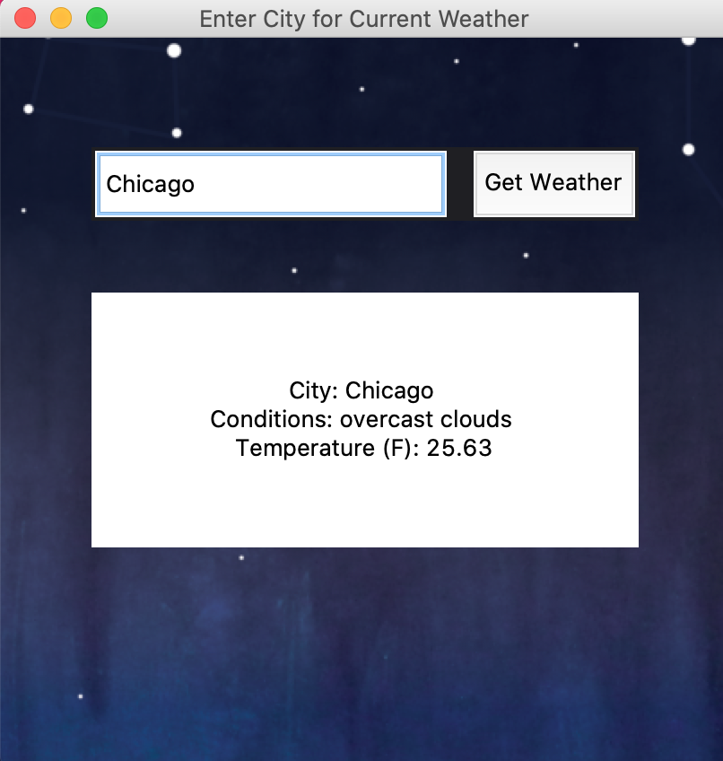

# Python Weather Apps

**weatherApp.py** - A simple application using Tkinter GUI components and the OpenWeatherMap API.

**daily_weather.py** - Similar to weatherApp, but uses the Twilio API to send the current weather via SMS. 

